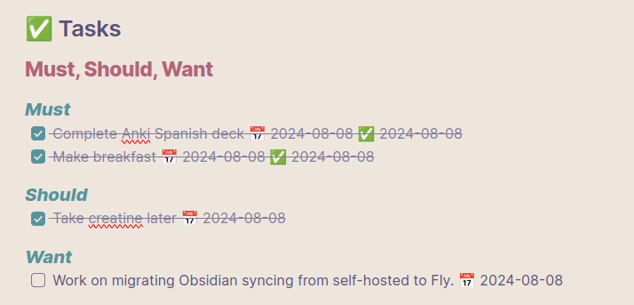

# write_daily_todos

Tool for automatically writing todos to the current [Obsidian](https://obsidian.md) daily note. I use this to enable my MemGPT agents to automatically divide/prioritize and create tasks for me. This is compatible by default with the Obsidian [Tasks plugin](https://github.com/obsidian-tasks-group/obsidian-tasks).

Each task is divided into three sections: must, should, and want. The output looks something like:



## Usage

Change these lines in accordance to your Obsidian daily note:

```
    VAULT_FOLDER = "<folder here>"
```

and

```
    tasks_pattern = r'## ✅ Tasks\n(.*?)(?=\n##|\Z)'
    new_tasks_section = "## ✅ Tasks\n"
```